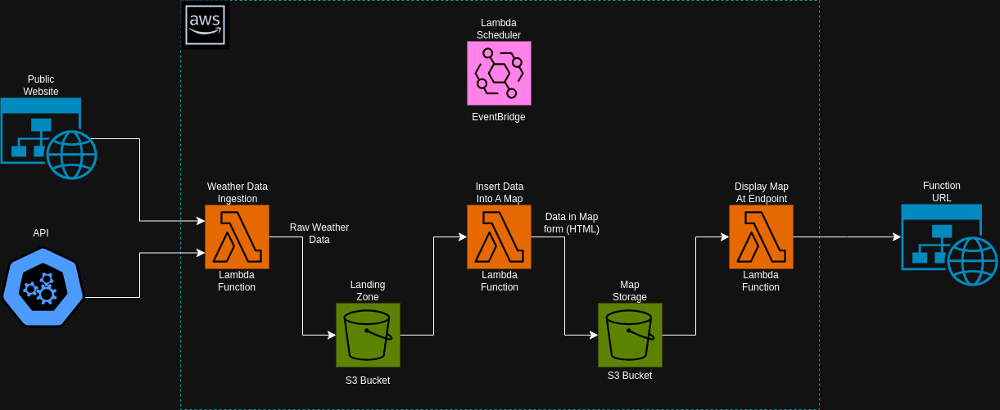
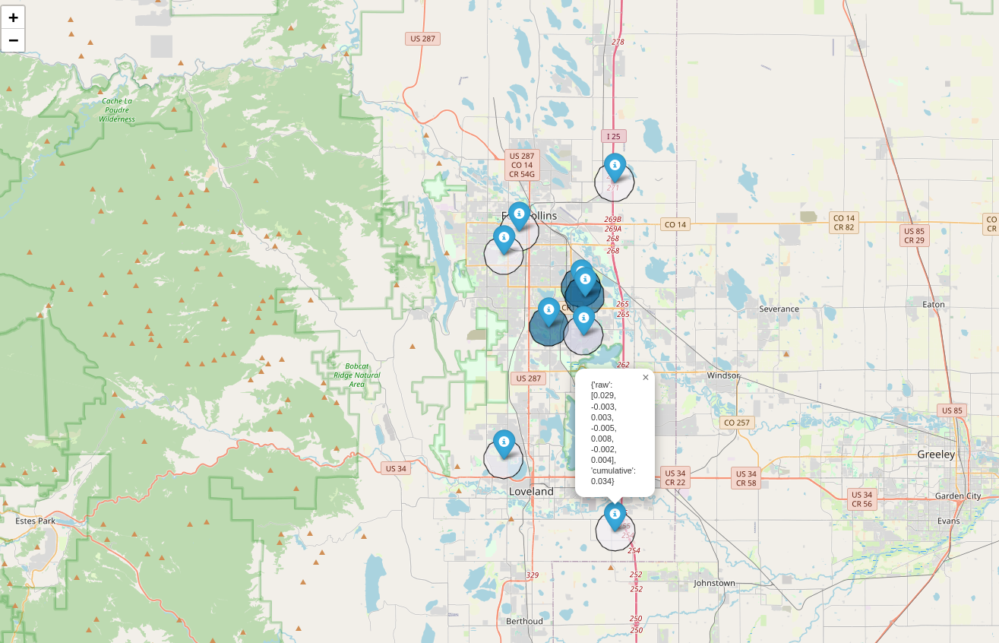

# Rain Data Pipeline
A little background: Precipitation patterns in my hometown seem to vary greatly even in just a few miles between one 
location and the next. Since I am an experienced data analyst who just completed a course in data engineering, I thought
this would be a fun way to try out some new skills while answering some fun questions. 

Also, I think we're all tired of analyzing e-commerce data :)

## Question:
Do different parts of my hometown experience significantly different weather patterns?

## Data Architecture:

Made using draw.io using AWS specific resources available [here](https://app.diagrams.net/?splash=0&libs=aws4) 

A brief architecture discussion: I wanted experiment and learn with essentially free resources on AWS. This is accomplished by:
* Lambda functions are [always free providing up to 1 million requests/month or 3.2 million seconds of compute/month](https://aws.amazon.com/pm/lambda/?gclid=Cj0KCQiAouG5BhDBARIsAOc08RSs18iC9yBwZSx-UVUHohxBfgMpB6Q9U9UdC210ZcdCFWtdPBmTHI4aAkauEALw_wcB&trk=73f686c8-9606-40ad-852f-7b2bcafa68fe&sc_channel=ps&ef_id=Cj0KCQiAouG5BhDBARIsAOc08RSs18iC9yBwZSx-UVUHohxBfgMpB6Q9U9UdC210ZcdCFWtdPBmTHI4aAkauEALw_wcB:G:s&s_kwcid=AL!4422!3!651212652669!p!!g!!amazon%20lambda!909122559!45462426916#:~:text=Always%20Free,time%C2%A0per%20month) 
* S3 buckets are essentially free at my testing scale ([$0.023/GB](https://aws.amazon.com/s3/pricing/?p=pm&c=s3&z=ranker#:~:text=50%20TB%20/%20Month-,%240.023%20per%20GB,-Next%20450%20TB) for storage and infrequent processing/access requests)
* EventBridge Scheduler is also free up to [14,000,000 million invocations/month](Free Tier: As part of the Free Tier, you can get started with EventBridge Scheduler at no cost. You can make 14,000,000 invocations per month for free)
* Finally, I've setup alerts on [AWS Billing and Cost Management](https://docs.aws.amazon.com/awsaccountbilling/latest/aboutv2/billing-what-is.html) 
to email me when a spend threshold is surpassed.

## Output from Data Pipeline:

This interactive map provides:
* The raw precipitation data for each location for the past 7 days.
* Information about the weather station from which the data was collected.
* Shaded regions indicating relative precipitation recorded at each station.

## Details on Labmda Functions:
All Lambda functions were written in python. However, these functions require python modules that are not included by default.
See [this reference](https://gist.github.com/gene1wood/4a052f39490fae00e0c3#file-all_aws_lambda_modules_python3-10-txt) for which modules are included by default in Lambda.
For modules that are not included, they must be downloaded and zipped for uploading to AWS Lambda.

To zip a Lambda function, its dependencies, and the configuration file: 
1. cd to the folder with the lambda to zip (i.e., "cd daily_extraction_lambda")
2. run "zip -r new-lambda-file.zip . .././config.py -x file1-to-not-zip.zip"
3. upload the resulting "new-lambda-file.zip" to AWS

